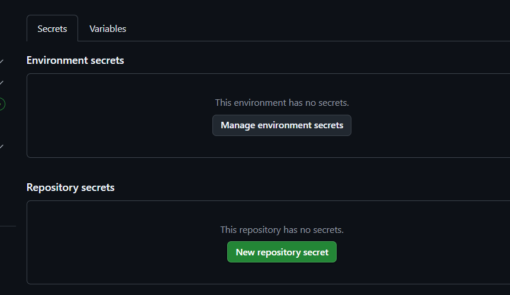

# 🌐 Challenge 8 - Group 208

Hướng dẫn triển khai hạ tầng đơn giản theo từng bước để kết nối Terraform với tài khoản AWS . 

---
## 📑 Table of Contents

- [📦 Prerequisites](#-prerequisites)
- [Hướng dẫn cài đặt Terraform bằng Chocolatey trên Windows](#hướng-dẫn-cài-đặt-terraform-bằng-chocolatey-trên-windows)
  - [Bước 1: Cài đặt Chocolatey](#bước-1-cài-đặt-chocolatey)
  - [Bước 2: Cài đặt Terraform](#bước-2-cài-đặt-terraform)
- [Kết nối Terraform với AWS](#kết-nối-terraform-với-aws)
  - [Bước 1: Cài đặt AWS CLI](#bước-1-cài-đặt-aws-cli)
  - [Bước 2: Tạo người dùng IAM và lấy thông tin truy cập](#bước-2-tạo-người-dùng-iam-và-lấy-thông-tin-truy-cập)
  - [Bước 3: Cấu hình AWS CLI](#bước-3-cấu-hình-aws-cli)
  - [Bước 4: Kiểm tra kết nối](#bước-4-kiểm-tra-kết-nối)
---

## 📦 Prerequisites

Trước khi bắt đầu, bạn cần cài đặt:
- Bạn phải có [Tài khoản AWS](https://aws.amazon.com/vi/free/?trk=947f595b-f07f-42a1-bfc4-acf832730bac&sc_channel=ps&ef_id=CjwKCAjw7MLDBhAuEiwAIeXGIVdjnkAmtIdxP6A3pQo_RD5aR_WbnyoGnObQJq8dK6ZkvrULgqdhnhoCkT4QAvD_BwE:G:s&s_kwcid=AL!4422!3!566333972302!e!!g!!t%E1%BA%A1o%20t%C3%A0i%20kho%E1%BA%A3n%20aws!15461586425!133325773849&gad_campaignid=15461586425&gbraid=0AAAAADjHtp_VsxSh0NtOGy0Q984Eg9pDc&gclid=CjwKCAjw7MLDBhAuEiwAIeXGIVdjnkAmtIdxP6A3pQo_RD5aR_WbnyoGnObQJq8dK6ZkvrULgqdhnhoCkT4QAvD_BwE&all-free-tier.sort-by=item.additionalFields.SortRank&all-free-tier.sort-order=asc&awsf.Free%20Tier%20Types=*all&awsf.Free%20Tier%20Categories=*all)
- Cài đặt [Terraform](https://developer.hashicorp.com/terraform/downloads)

---
## Hướng dẫn cài đặt Terraform bằng Chocolatey trên Windows

Chocolatey là một trình quản lý gói (Package Manager) dành cho hệ điều hành Windows cho phép bạn cài đặt, cập nhật và gỡ bỏ phần mềm dễ dàng thông qua CLI (Command Line Interface).

### Bước 1: Cài đặt Chocolatey

1. Mở Windows Powershell trên máy với quyền Admin (Run as administrator)
2. Chạy câu lệnh sau:
```bash

Set-ExecutionPolicy Bypass -Scope Process -Force; `
[System.Net.ServicePointManager]::SecurityProtocol = `
[System.Net.ServicePointManager]::SecurityProtocol -bor 3072; `
iex ((New-Object System.Net.WebClient).DownloadString('https://community.chocolatey.org/install.ps1'))

```
3. Kiểm tra phiên bản của Chocolatey bằng câu lệnh:
```bash

choco -v

```
4. Kết quả: 
```bash

2.3.0

```
   
### Bước 2: Cài đặt Terraform

1. Trên Windows Powershell, chạy câu lệnh sau:

```bash

choco install terraform -y

```
2. Kiểm tra phiên bản của Terraform bằng câu lệnh:

```bash

terraform -v

```
3. Kết quả:

```bash

Terraform v1.12.2
on windows_amd64

```

- Bạn có thể xem hướng dẫn cài đặt terraform cho Linux, MacOs tại đây: https://developer.hashicorp.com/terraform/tutorials/aws-get-started/install-cli
---

##  Kết nối Terraform với AWS 

### Bước 1. Cài đặt AWS CLI 

#### 1.1 Cài AWS CLI bằng 
```bash
C:\> msiexec.exe /i https://awscli.amazonaws.com/AWSCLIV2.msi
```

#### 1.2 Để xác nhận việc cài đặt, hãy mở menu Start, tìm kiếm "cmd" để mở cửa sổ dòng lệnh (Command Prompt), và trong cửa sổ đó, sử dụng lệnh aws --version.

```bash
C:\> aws --version
aws-cli/2.19.1 Python/3.11.6 Windows/10 exe/AMD64 prompt/off
```
### Bước 2. TẠO NGƯỜI DÙNG IAM VÀ LẤY THÔNG TIN TRUY CẬP
#### 2.1 Vào AWS console 
Tìm kiếm [IAM](https://console.aws.amazon.com/iam)
### 2.2 Tạo IAM User
- Chọn Users > nhấn nút Add users

- Nhập tên (ví dụ: terraform-user)

- Chọn Access key - Programmatic access

- Nhấn Next
### 2.3 Gán quyền
- tick chọn **AdministratorAccess**
### 2.4 Tạo Access Key
Vào IAM chọn **Security credentials**

Chọn **Create access key**

Chọn **(CLI)** rồi **Done**

Đặt tên cho access key 

Tạo thành công 


### Bước 3. cấu hình AWS CLI
Sau khi đã có **Access Key** và **Secret Key**, mở CMD:

```bash
aws configure
```
Sau đó nhập:
```bash
AWS Access Key ID [None]: <dán key của bạn>
AWS Secret Access Key [None]: <dán key của bạn>
Default region name [None]: ap-southeast-1  # Singapore 
Default output format [None]: json
```

### Bước 4: Kiểm tra kết nối 
Kiểm tra bằng:
```bash
aws s3 ls
```
**Nếu hiện danh sách bucket (hoặc trống), tức là CLI hoạt động thành công.**

---
##  Tạo Github Actions

### Tạo Access Key
Vào IAM chọn **Security credentials**

Chọn **Create access key**

Chọn **(CLI)** rồi **Done**

Đặt tên cho access key 

Tạo thành công 

### Vào repo chọn **setting**

### Vào cột bên trái chọn **secrets and varialbe** -> chọn **Actions**
### Chọn **New repository secrect**

Tạo  **access key**

điền phần **name**
```bash
AWS_ACCESS_KEY_ID
```
**Secret**
```bash
<dán key của bạn ở CLI AWS>
```
xong bấm tạo **add secret**

Tạo **Secret access key**

điền phần **name**
```bash
AWS_SECRET_ACCESS_KEY
```
**Secret**
```bash
<dán key của bạn ở CLI AWS>
```
xong bấm tạo **add secret**