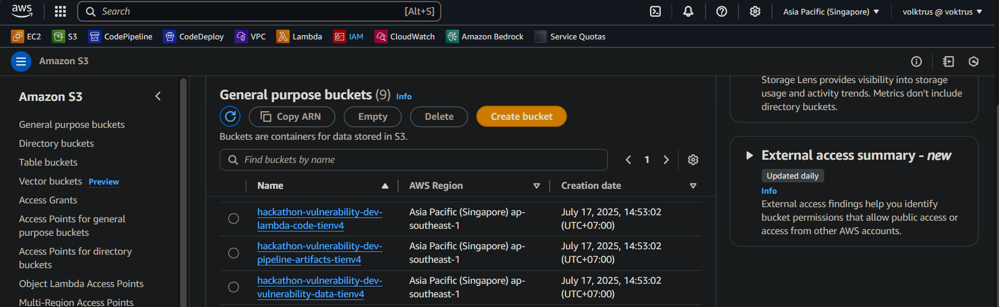
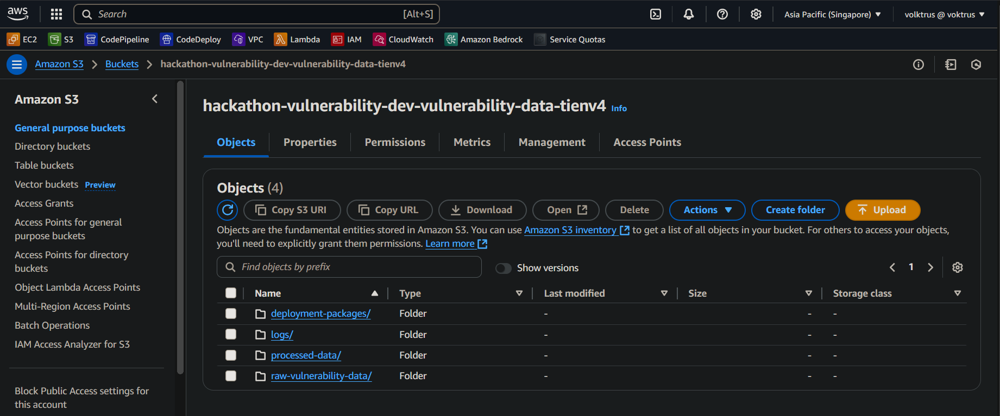
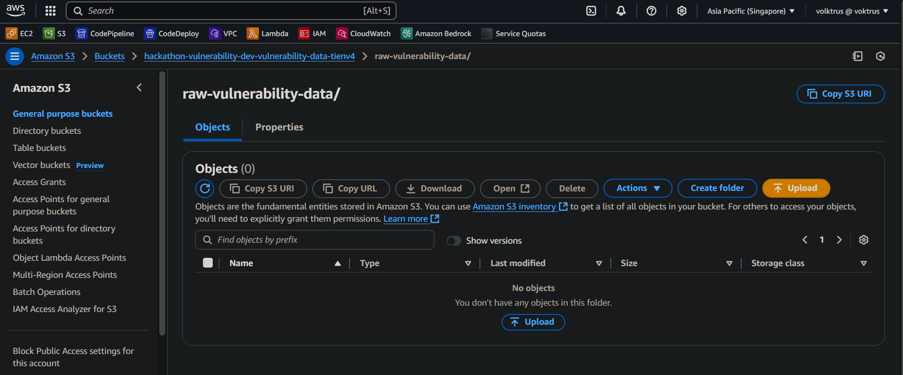
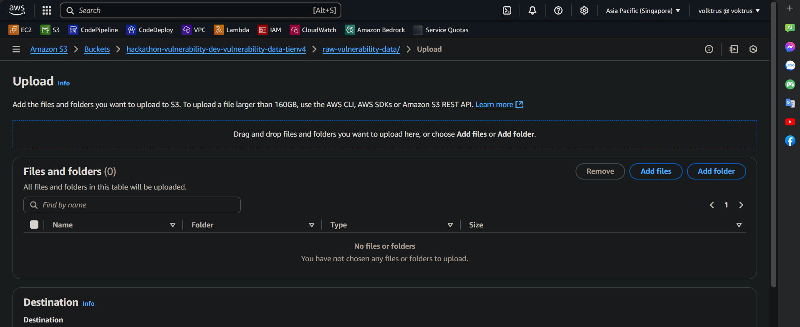
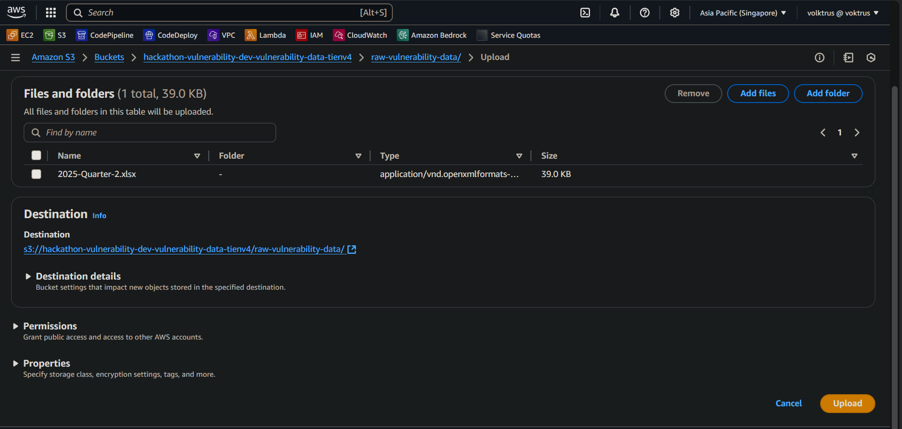
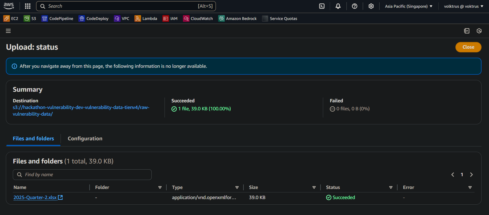

# 🌐 Challenge 8 - Nhóm 208 - Hướng dẫn chi tiết triển khai hạ tầng

**CHALLENGE 8: CI/CD PIPELINE FOR AUTOMATING WINDOWS SECURITY PATCHING FROM VULNERABILITY REPORT**

**Architecture of Solution:**


---
## 📑 Table of Contents

- [Prerequisites](#prerequisites)


- [Hướng dẫn cài đặt Terraform bằng Chocolatey trên Windows](#hướng-dẫn-cài-đặt-terraform-bằng-chocolatey-trên-windows)
  - [Bước 1: Cài đặt Chocolatey](#bước-1-cài-đặt-chocolatey)
  - [Bước 2: Cài đặt Terraform](#bước-2-cài-đặt-terraform)

  
- [Kết nối Terraform với AWS](#kết-nối-terraform-với-aws)
  - [Bước 1: Cài đặt AWS CLI](#bước-1-cài-đặt-aws-cli)
  - [Bước 2: Tạo người dùng IAM và lấy thông tin truy cập](#bước-2-tạo-thông-tin-người-dùng-và-thông-tin-truy-cập)
  - [Bước 3: Cấu hình AWS CLI](#bước-3-cấu-hình-aws-cli)
  - [Bước 4: Kiểm tra kết nối](#bước-4-kiểm-tra-kết-nối)


- [Cài đặt mã nguồn và quản lý GitHub Repository](#cài-đặt-các-gói-mã-nguồn)  
  - [Bước 1: Các kho lưu trữ](#bước-1-các-kho-lưu-trữ)  
  - [Bước 2: Hướng dẫn tải và giải nén](#bước-2-hướng-dẫn-tải-và-giải-nén) 
 


- [Hướng dẫn tạo repository GitHub cho `vulnerability-scripts`](#hướng-dẫn-tạo-repository-github-cho-vulnerability-scripts)
  - [Bước 1: Tạo repository mới trên GitHub](#bước-1-tạo-repository-mới-trên-github)
  - [Bước 2: Kết nối repository từ máy tính](#bước-2-kết-nối-repository-từ-máy-tính)


  


- [Thiết lập GitHub Actions với AWS Credentials](#thiết-lập-github-actions-với-aws-credentials)  
  - [Bước 1. Tạo Access Key](#bước-1-tạo-access-key)  
  - [Bước 2. Thêm Secrets vào GitHub](#bước-2-thêm-secrets-vào-github)  
 
- [Thực hiện chạy code Terraform ](#thực-hiện-chạy-code-terraform)
- [Đẩy file data lên Amazon S3 để chạy pipeline](#đẩy-file-data-lên-amazon-s3-để-chạy-pipeline)


  
---

## Prerequisites

Trước khi bắt đầu, bạn cần cài đặt:
- Bạn phải có [Tài khoản AWS](https://aws.amazon.com/vi/free/?trk=947f595b-f07f-42a1-bfc4-acf832730bac&sc_channel=ps&ef_id=CjwKCAjw7MLDBhAuEiwAIeXGIVdjnkAmtIdxP6A3pQo_RD5aR_WbnyoGnObQJq8dK6ZkvrULgqdhnhoCkT4QAvD_BwE:G:s&s_kwcid=AL!4422!3!566333972302!e!!g!!t%E1%BA%A1o%20t%C3%A0i%20kho%E1%BA%A3n%20aws!15461586425!133325773849&gad_campaignid=15461586425&gbraid=0AAAAADjHtp_VsxSh0NtOGy0Q984Eg9pDc&gclid=CjwKCAjw7MLDBhAuEiwAIeXGIVdjnkAmtIdxP6A3pQo_RD5aR_WbnyoGnObQJq8dK6ZkvrULgqdhnhoCkT4QAvD_BwE&all-free-tier.sort-by=item.additionalFields.SortRank&all-free-tier.sort-order=asc&awsf.Free%20Tier%20Types=*all&awsf.Free%20Tier%20Categories=*all)
- Cài đặt [Terraform](https://developer.hashicorp.com/terraform/downloads)
- Có tài khoản GitHub ([https://github.com](https://github.com))
- Đã cài đặt **Git** trên máy ([Tải Git](https://git-scm.com/))
---
# Hướng dẫn cài đặt Terraform bằng Chocolatey trên Windows

Chocolatey là một trình quản lý gói (Package Manager) dành cho hệ điều hành Windows cho phép bạn cài đặt, cập nhật và gỡ bỏ phần mềm dễ dàng thông qua CLI (Command Line Interface).

### Bước 1: Cài đặt Chocolatey

1.1. Mở Windows Powershell trên máy với quyền Admin (Run as administrator)

1.2. Chạy câu lệnh sau:
```bash

Set-ExecutionPolicy Bypass -Scope Process -Force; `
[System.Net.ServicePointManager]::SecurityProtocol = `
[System.Net.ServicePointManager]::SecurityProtocol -bor 3072; `
iex ((New-Object System.Net.WebClient).DownloadString('https://community.chocolatey.org/install.ps1'))

```
1.3. Kiểm tra phiên bản của Chocolatey bằng câu lệnh:
```bash

choco -v

```
1.4. Kết quả:
```bash

2.3.0

```
   
### Bước 2: Cài đặt Terraform

2.1. Trên Windows Powershell, chạy câu lệnh sau:

```bash

choco install terraform -y

```
2.2. Kiểm tra phiên bản của Terraform bằng câu lệnh:

```bash

terraform -v

```
2.3. Kết quả:

```bash

Terraform v1.12.2
on windows_amd64

```

- Bạn có thể xem hướng dẫn cài đặt terraform cho Linux, MacOs [tại đây]( https://developer.hashicorp.com/terraform/tutorials/aws-get-started/install-cli)
---

#  Kết nối Terraform với AWS 

### Bước 1. Cài đặt AWS CLI 

1.1. Mở Windows Powershell trên máy với quyền Admin (Run as administrator)
1.2. Chạy câu lệnh sau:

```bash
C:\> msiexec.exe /i https://awscli.amazonaws.com/AWSCLIV2.msi
```

1.3 Để xác nhận việc cài đặt, bạn tìm kiếm "cmd" để mở cửa sổ dòng lệnh (Command Prompt), sau đó sử dụng lệnh aws --version.
1.4. Kết quả:

```bash
C:\> aws --version
aws-cli/2.19.1 Python/3.11.6 Windows/10 exe/AMD64 prompt/off
```
### Bước 2. Tạo thông tin người dùng và thông tin truy cập
2.1. Tại trang console, bạn hãy tìm kiếm [IAM](https://console.aws.amazon.com/iam)

2.2. Thực hiện tạo IAM User bằng cách:
- Chọn Users > nhấn nút Add users

- Nhập tên (ví dụ: terraform-user)

- Chọn Access key - Programmatic access

- Nhấn Next
2.3. Thực hiện gán quyền bằng cách:
- tick chọn **AdministratorAccess**
2.4. Tạo Access Key
- Vào IAM chọn **Security credentials**

- Tiếp theo, chọn **Create access key**

- Chọn **Command Line Interface (CLI)**
- Xác nhận bằng cách tick vào ô **I understand the above recommendation and want to proceed to create an access key** rồi chọn **Next**

- Bạn có thể ghi mô tả của access key sau đó bấm **Create Access Key**

- Kết quả sau khi tạo thành công 


### Bước 3. cấu hình AWS CLI
3.1. Sau khi đã có **Access Key** và **Secret Key**, mở CMD:

```bash
aws configure
```
3.2. Sau đó nhập thông tin:
```bash
AWS Access Key ID [None]: <dán key của bạn>
AWS Secret Access Key [None]: <dán key của bạn>
Default region name [None]: ap-southeast-1  # Singapore 
Default output format [None]: json
```

### Bước 4: Kiểm tra kết nối 
Bạn kiểm tra bằng câu lệnh:
```bash
aws s3 ls
```
**Nếu hiện danh sách bucket (hoặc trống), tức là CLI kết nối thành công.**

---
# Cài đặt các gói mã nguồn

## Bước 1: Các kho lưu trữ
**Lưu ý**: File script được lưu riêng tại một folder khác vi.
- **Vulnerability Scripts:** [https://github.com/imLeHuyHoang/vulnerability-scripts.git](https://github.com/imLeHuyHoang/vulnerability-scripts.git)
- **Hackathon Terraform:** [https://github.com/imLeHuyHoang/hackathonterraform.git](https://github.com/imLeHuyHoang/hackathonterraform.git)


## Bước 2. Hướng dẫn tải và giải nén

### 2.1: Tải file ZIP từ GitHub

2.1.1. Truy cập GitHub của mỗi kho lưu trữ qua đường link tại Bước 1.

2.1.2. Nhấn nút **Code** (màu xanh lá).

2.1.3. Chọn **Download ZIP** để tải file `.zip` về máy.

### 2.2: Giải nén file ZIP

2.2.1 Sau khi tải về, bạn sẽ có 2 file ZIP:

- `vulnerability-scripts-main.zip`
- `hackathonterraform-main.zip`

2.2.2. Tiến hành giải nén:

- Nếu bạn dùng **Windows**: Nhấp chuột phải vào file ZIP → Chọn **Extract All...**.

- Sau khi giải nén, bạn phải đổi tên các folder thành `vulnerability-scripts` và `hackathonterraform`

  
# Hướng dẫn tạo repository GitHub cho `vulnerability-scripts`

### Bước 1: Tạo repository mới trên GitHub

1.1. **Đăng nhập** vào tài khoản GitHub.
1.2. Ở góc phải trên cùng, bấm nút **`+`** ➜ chọn **`New repository`**.
1.3. Điền thông tin:
   - **Repository name:** `vulnerability-scripts`
   - **Description:** Mô tả ngắn gọn, ví dụ: *Scripts for vulnerability scanning and management*
   - Chọn **Public** hoặc **Private** tuỳ ý.
   - **Không tick** vào *Initialize this repository with a README* (vì bạn đã có code sẵn).
1.4. Bấm **Create repository**.

---

### Bước 2: Kết nối repository từ máy tính

#### Mở terminal/command line và chạy tập lệnh sau:

```bash
# Di chuyển vào thư mục vulnerability-scripts (chỉnh lại đường dẫn cho đúng)
cd path/to/vulnerability-scripts

# Khởi tạo Git (nếu chưa có)
git init

# Thêm remote origin trỏ đến repo GitHub vừa tạo
git remote add origin https://github.com/<YOUR_USERNAME>/vulnerability-scripts.git

# Thêm toàn bộ file
git add .

# Commit lần đầu
git commit -m "Initial commit"

# Đặt nhánh chính tên 'main'
git branch -M main

# Đẩy code lên GitHub
git push -u origin main
```

# Chỉnh sửa code Terraform để triển khai
## Yêu cầu 
- Máy tính đã cài **Visual Studio Code** ([Tải VS Code](https://code.visualstudio.com/))
- Đã configure AWS CLI
- Đã có mã nguồn Terraform (`hackathonterraform`)
- Đã tạo **Github Repo** cho `vulnerability-scripts`

### Bước 1: Mở thư mục dự án bằng VS Code

1. Mở **Visual Studio Code**.
2. Chọn **`File` → `Open Folder...`**.
3. Duyệt đến thư mục `hackathonterraform`
4. Bấm **`Open`**.

VS Code sẽ mở toàn bộ project, hiển thị cấu trúc file bên thanh bên trái.

### Bước 2: Chỉnh sửa code Terraform

- Mở file `terraform.tfvars` tại thư mục `root`
- Thực hiện thay đổi giá trị biến `project_name`từ `hackathon-vulnerability` thành `hackathon-vulnerability-vpbank`

- Sau đó, mở file `variables.tf` trong thư mục `root`. Tại đó, bạn thực hiện thay đổi biến `github_repo_url` với giá trị `default` là link github chứa source code `vulnerability srcipts` mà bạn đã tạo.

# Chỉnh sửa code Vulnerability-scripts để chạy demo
## Yêu cầu 
- Máy tính đã cài **Visual Studio Code** ([Tải VS Code](https://code.visualstudio.com/))
- Đã có mã nguồn `vulnerability-scripts`
- Đã tạo **Github Repo** cho `vulnerability-scripts`

### Bước 1: Mở thư mục dự án bằng VS Code

1. Mở **Visual Studio Code**.
2. Chọn **`File` → `Open Folder...`**.
3. Duyệt đến thư mục `vulnerability-scripts`
4. Bấm **`Open`**.

VS Code sẽ mở toàn bộ project, hiển thị cấu trúc file bên thanh bên trái.

### Bước 2: Chỉnh sửa code Vulnerability-scripts

- Trong folder `.github`, bạn truy cập `scripts`, tại file `create-deployment-packages.py` bạn sửa giá trị của biến `S3_BUCKET` thành `os.environ.get('S3_BUCKET', 'hackathon-vulnerability-vpbank-dev-vulnerability-data')`


- Trong foler `.github`, bạn truy cập `workflows`, tại file `deploy-packages.yml`, bạn sửa giá trị của biến `S3_BUCKET` thành `hackathon-vulnerability-vpbank-dev-vulnerability-data`


- Sau khi sửa xong mã nguồn, bạn thực hiện commit code mới lên **Github Repo** `vulnerability-scripts` của bạn bằng các câu lệnh sau: 
```
git add .
git commit -m "new code scripts commit"
git push -u origin main
```

# Thiết lập GitHub Actions với AWS Credentials

## Bước 1. Tạo Access Key
1.1. Truy cập AWS Console, vào IAM, chọn User mà bạn đã configure AWS CLI, sau đó chọn **Security credentials**
1.2. Thực hiện tạo Access Key theo hướng dẫn [bên trên](#bước-2-tạo-người-dùng-iam-và-lấy-thông-tin-truy-cập)


## Bước 2. Thêm Secrets vào GitHub

2.1. Vào repo `vulnerability-scripts` chọn **setting**


2.2. Tại thanh menu bên trái, chọn **secrets and varialbe** -> chọn **Actions**

2.3. Chọn **New repository secrect**


2.4 Tạo Github Action  **Access key**

- Đặt tên cho phần **name**
  VD: "AWS_ACCESS_KEY_ID"
  
- Copy Access Key vừa tạo và paste vào phần**Secret**
```bash
<Dán key của bạn ở CLI AWS>
```
- Sau đó bấm tạo **add secret**

2.5. Tạo **Secret access key**

- Đặt tên cho phần **name**
  VD: "AWS_SECRET_ACCESS_KEY"

- Copy Secret Access Key vừa tạo và paste vào phần **Secret**
```bash
<dán key của bạn ở CLI AWS>
```

- Xong bấm tạo **add secret**
  
# Thực hiện chạy code Terraform
Sử dụng VScode để mở thư mục **hackathonterraform**, sau đó mở terminal lên và thực hiện các câu lệnh sau: 
1. Khởi tạo Terraform:
```
Terraform init
```
2. Kiểm tra trước những thay đổi Terraform sẽ thực hiện:
```
Terraform plan
```
3. Áp dụng các thay đổi để tạo hoặc cập nhật hạ tầng:
```
Terraform apply
```
4. Xóa toàn bộ tài nguyên được quản lý bởi Terraform (Lưu ý: chỉ xóa toàn bộ khi đã thực hiện xong demo):
```
Terraform destroy
```
# Đẩy file data lên Amazon S3 để chạy pipeline
**Yêu cầu**
- Đã chạy câu lệnh terraform apply
- Đã có file data

1. Kiểm tra Bucket đã tạo

2.Sau khi đã chạy terraform apply thành công, bạn truy cập AWS Console, truy cập dịch vụ S3 và kiểm tra xem đã có Bucket hay chưa

- Chọn **<TÊN BUCKET CỦA BẠN>**


- Chọn **raw-vulnerability-data/**


- Bấm **Upload**


- Bấm **Add folder**


- Chọn file **2025-Quarter-2.xlsx** -> click **Upload**


- Đây là giao diện khi **Upload** file thành công 


